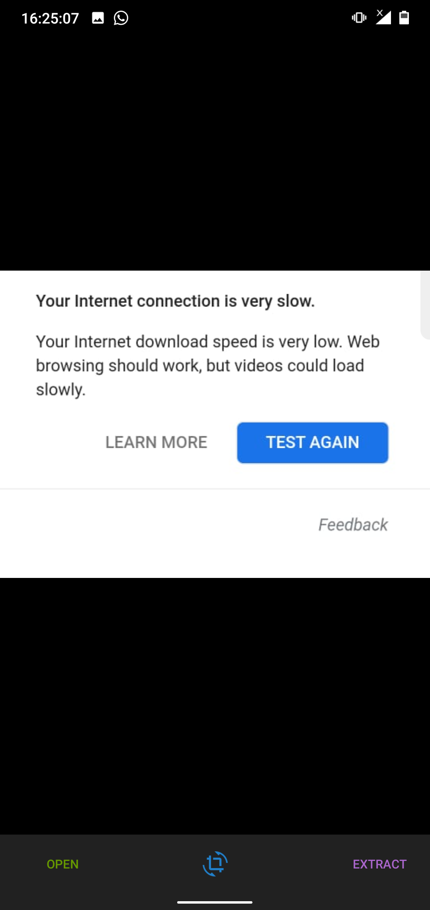

# Lexicon-ocr
Lexicon is an OCR based Android Application used to extract text from images. This is part of my Capstone Project of Android Developer Nanodegree Udacity which I got as a part of Google India Challenge Scholarship 2018

